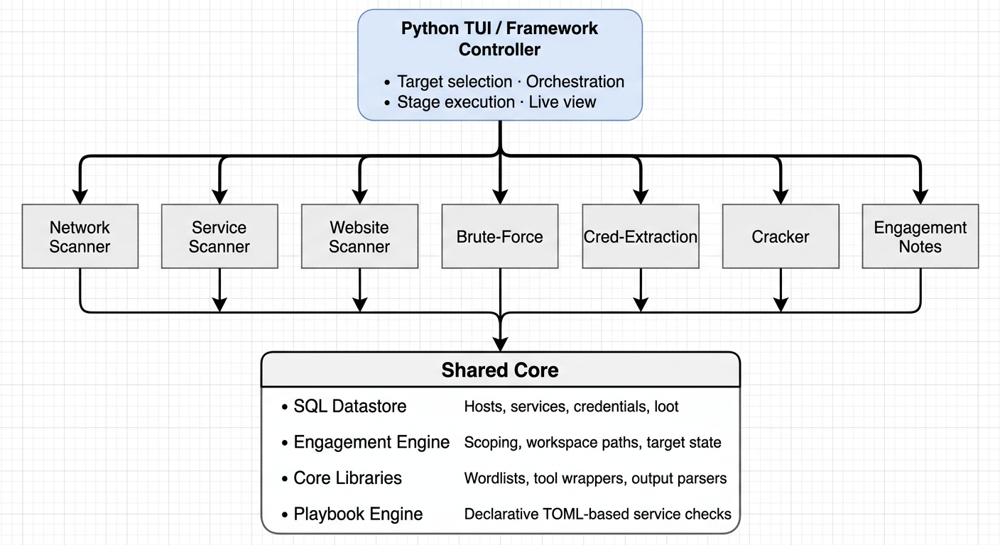

# Strafekit(In Progress)
**A modular pentesting framework that automates the recon-to-exploitation loop across full engagements.**
StrafeKit unifies the repetitive, fragmented stages of a network penetration test into a cohesive. 
Instead of juggling loose text files and disconnected tabs, StrafeKit centralizes context so every tool benefits from the findings of the last.

# Architecture & Data Flow
Modules operate independently and hand off findings asynchronously through a central SQL Datastore.
NetworScanner: Enumerate Networks,host, and ports.
WebRecon: 
ServiceScanner: Finds misconfiguration and tags vulnerable versions
BruteForce: Ability to target webpages and services
Cracker: cracks passwords add to database for test, hashs can be saved with credentials 
    or lone one of hashes. 
LateralAccess: tries multiply user and password combinations and notifies which have succeded.

Here is a revised, polished version of your `README.md` that incorporates your new web reconnaissance phases, fixes incomplete sentences, and integrates the architectural updates while maintaining a clear technical style.

---

# StrafeKit

**A modular pentesting framework that automates the recon-to-exploitation loop across full engagements.**

StrafeKit unifies the repetitive, fragmented stages of a network penetration test into a cohesive, data-driven workflow. 
Instead of juggling loose text files and disconnected terminal tabs, StrafeKit centralizes context so every tool benefits from the findings of the last.

## Architecture & Data Flow
Modules operate independently and hand off findings asynchronously through a central **SQL Datastore**. 
Tools do not call each other directly; instead, module outputs update state tables, which sequentially drive subsequent assessment phases.

---

## Module Overview

| Module | Purpose |
| :--- | :--- |
| **NetworkScanner** | Sweeps targets to perform host discovery, port mapping, and network surface identification. |
| **WebRecon** | Handles multi-phase web reconnaissance, including spidering, parameter hunting, secret extraction, directory brute-forcing, and access control bypasses. |
| **ServiceScanner** | Identifies service misconfigurations, maps protocols, and tags known vulnerable software versions across exposed ports. |
| **BruteForce** | Executes credential attacks against web authentication forms, APIs, and network protocol services using context-driven wordlists. |
| **Cracker** | Runs offline hash cracking against recovered hashes (standalone or linked to extracted accounts) and feeds cracked passwords back into the datastore. |
| **LateralAccess** | Tests credential pairs across discovered services and hosts to validate access rights and notify on success. |
| **EngagementNotes** | Generates target-bound, copy-paste-ready command playbooks populated dynamically with live engagement data. |

